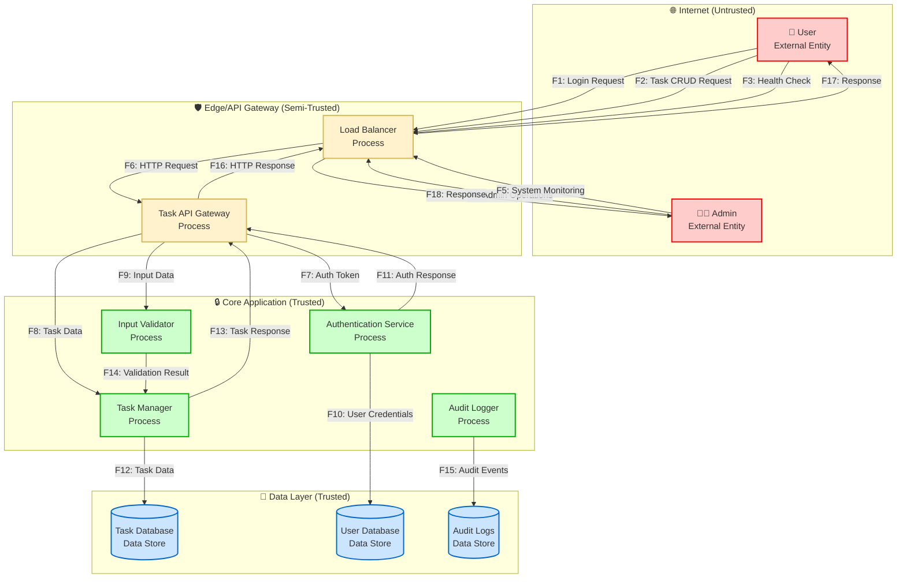
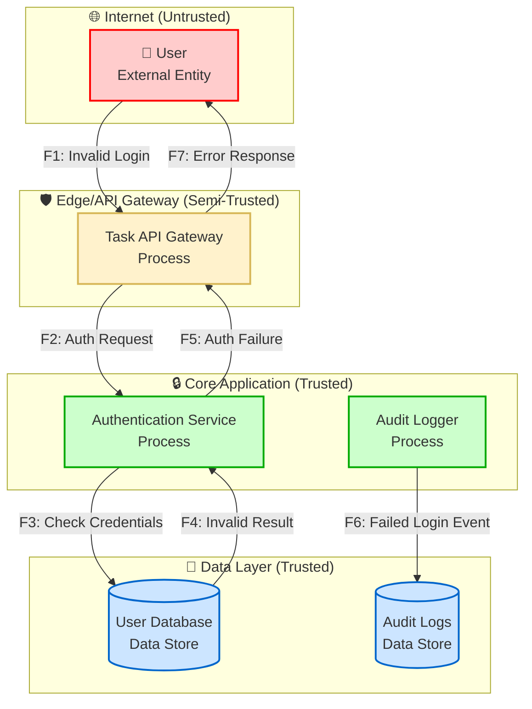

# Data Flow Diagram (DFD) - Task Tracker

## Обзор
Данный документ содержит Data Flow Diagram для Task Tracker приложения, показывающий потоки данных, границы доверия и основные компоненты системы.

## Основная DFD диаграмма

## Описание потоков данных

| ID | Поток | Описание | Протокол | Данные |
|----|-------|----------|----------|--------|
| F1 | Login Request | Запрос аутентификации пользователя | HTTPS | Username, Password |
| F2 | Task CRUD Request | Операции с задачами (создание, чтение, обновление, удаление) | HTTPS | Task Data, Auth Token |
| F3 | Health Check | Проверка состояния системы | HTTPS | Health Status Request |
| F4 | Admin Operations | Административные операции | HTTPS | Admin Commands, Auth Token |
| F5 | System Monitoring | Мониторинг системы | HTTPS | Metrics, Logs |
| F6 | HTTP Request | HTTP запрос от клиента | HTTP/HTTPS | Request Data |
| F7 | Auth Token | Токен аутентификации | Internal | JWT Token |
| F8 | Task Data | Данные задач | Internal | Task Object |
| F9 | Input Data | Входные данные для валидации | Internal | Raw Input |
| F10 | User Credentials | Учетные данные пользователя | Internal | Username, Hashed Password |
| F11 | Auth Response | Ответ аутентификации | Internal | Auth Result |
| F12 | Task Data | Данные задач в БД | Internal | Task Entity |
| F13 | Task Response | Ответ с данными задачи | Internal | Task Object |
| F14 | Validation Result | Результат валидации | Internal | Validation Status |
| F15 | Audit Events | События аудита | Internal | Audit Log Entry |
| F16 | HTTP Response | HTTP ответ клиенту | HTTP/HTTPS | Response Data |
| F17 | Response | Ответ пользователю | HTTPS | Task Data, Status |
| F18 | Response | Ответ администратору | HTTPS | Admin Data, Status |

## Границы доверия (Trust Boundaries)

### 1. Internet (Untrusted)
- **Описание**: Внешняя сеть, неконтролируемая среда
- **Компоненты**: User, Admin
- **Угрозы**: Man-in-the-middle, Data interception, Malicious requests
- **Защита**: TLS encryption, Input validation, Rate limiting

### 2. Edge/API Gateway (Semi-Trusted)
- **Описание**: Периферийные компоненты, частично контролируемые
- **Компоненты**: Load Balancer, Task API Gateway
- **Угрозы**: DDoS attacks, Malformed requests, Protocol attacks
- **Защита**: Rate limiting, Request filtering, Protocol validation

### 3. Core Application (Trusted)
- **Описание**: Основные бизнес-логика и процессы
- **Компоненты**: Authentication Service, Task Manager, Input Validator, Audit Logger
- **Угрозы**: Logic flaws, Authorization bypass, Data corruption
- **Защита**: Input validation, Authorization checks, Audit logging

### 4. Data Layer (Trusted)
- **Описание**: Хранилища данных, критически важные компоненты
- **Компоненты**: Task Database, User Database, Audit Logs
- **Угрозы**: Data breach, Data corruption, Unauthorized access
- **Защита**: Encryption at rest, Access controls, Backup procedures

## Альтернативный сценарий: Ошибка аутентификации

## Ключевые элементы системы

### Внешние участники (External Entities)
- **User**: Обычный пользователь Task Tracker
- **Admin**: Администратор системы

### Процессы (Processes)
- **Load Balancer**: Распределение нагрузки
- **Task API Gateway**: API шлюз для операций с задачами
- **Authentication Service**: Сервис аутентификации
- **Task Manager**: Управление задачами
- **Input Validator**: Валидация входных данных
- **Audit Logger**: Логирование аудита

### Хранилища данных (Data Stores)
- **Task Database**: База данных задач
- **User Database**: База данных пользователей
- **Audit Logs**: Логи аудита

## Связь с NFR из P03

- **NFR-001**: Task Creation Response Time - влияет на потоки F2, F8, F13
- **NFR-002**: Task Tracker Availability - влияет на все потоки
- **NFR-003**: Task Operation Error Rate - влияет на потоки F2, F8, F13
- **NFR-004**: User Authentication Security - влияет на потоки F1, F7, F10, F11
- **NFR-005**: Task Data Validation - влияет на потоки F9, F14
- **NFR-006**: Task Data Encryption - влияет на потоки F12, F15
- **NFR-007**: Task Activity Logging - влияет на поток F15
- **NFR-008**: Task API Rate Limiting - влияет на потоки F1, F2, F4
- **NFR-009**: Task Access Control - влияет на потоки F2, F8, F12
- **NFR-011**: Task Session Security - влияет на потоки F1, F7, F11
- **NFR-012**: Task Data Privacy - влияет на все потоки с данными задач
